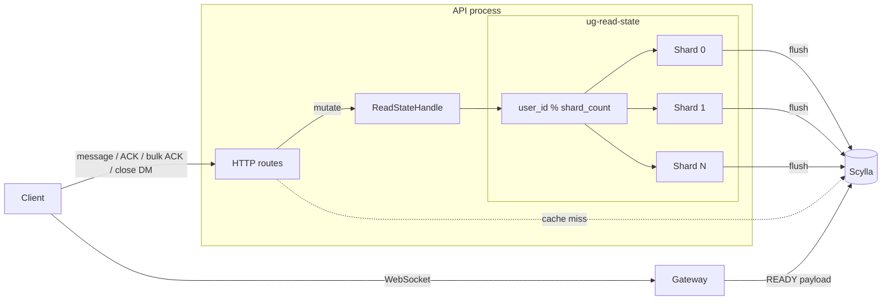

# ug-read-state

In-process, sharded read-state mutation worker for Celeste (a reimplementation of the Discord backend).

Read state sits on the hot path : DMs, ACKs, reconnects all touch it constantly.

This crate serializes all read-state mutations per user in memory, one async worker shard per user, no distributed coordination needed.

## Background

`read_state_repo` was Celeste's original persistence layer for read states, it was a thin repository over Scylla that both the API and the Gateway called directly to read and write `(user_id, channel_id)` records. It worked fine as a CRUD interface, but Scylla is last-write-wins by default, that means that two concurrent writes on the same row don't merge, one just shadows the other.

When write volume increased, the failure mode became obvious. DM mention paths were wrapped in Redis locks, and ACK flows did read-modify-write cycles, read the current counter from Scylla, recompute, and write back.

That meant extra round trips on every ACK just to keep `mention_count` coherent, and the locks added contention without actually guaranteeing ordering (a lock protects mutual exclusion, not sequencing). The mutation logic itself was spread across route handlers and Gateway helpers, so ordering was a property of call-site discipline rather than a property of the system.

In practice, we ended up piling on Redis locks, atomic Lua scripts, and read-modify-write logic just to approximate guarantees a relational database would usually give us for free, which as you can guess, quickly turned into a mess.

`ug-read-state` was extracted as a separate crate to consolidate all of that behind one rule: every mutation for a given user goes through one in-memory shard, processed in order. That removes the distributed locks and the read-modify-write cycles from the hot path entirely. 

The repo layer still exists for raw persistence, but the API no longer calls it directly for writes, now everything goes through `ReadStateHandle`.

Discord described a similar pressure pattern in [Why Discord is switching from Go to Rust](https://discord.com/blog/why-discord-is-switching-from-go-to-rust): per-user state, high write volume, and poor behavior when ordering has to be reconstructed around a last-write-wins store.

The implementation here is specific to Celeste, but the design rationale transfers directly.

## Architecture

`ug-read-state` is **not** a standalone service. It runs embedded in the API process and exposes a `ReadStateHandle`.

**Writes** go through the handle -> routed to a shard via `user_id % shard_count` -> processed in order -> dirty entries flushed to Scylla periodically and at shutdown. 
**Reads** can go through the handle for hot data or hit Scylla directly (e.g. Gateway READY payloads).

The key invariant is that all mutations for a given user are serialized by exactly one shard; ordering comes from the worker, not from distributed locking or CAS.

## Scope

Covered:

- `mention_count` tracking for DM unread badges
- ACK and bulk ACK ordering
- read-state deletion (DM close/delete)
- post-delete DM mention recomputation
- periodic + shutdown flush to Scylla
- dirty-entry eviction (only after successful flush)
- cache-miss backfill from Scylla
- Guild `@user` / `@everyone` / role mention fanout
- `allowed_mentions` evaluation

Not covered (yet):
- Notification preference filtering
- Cross-instance cache invalidation

## Configuration

| Knob | Default | Meaning |
|---|---:|---|
| `read_state_shard_count` | `16` | Number of worker shards |
| `read_state_shard_channel_capacity` | `4096` | Per-shard queue soft limit |
| `read_state_flush_interval_secs` | `30` | Periodic flush cadence |
| `read_state_max_entries_per_shard` | `50_000` | In-memory entry budget per shard before eviction starts |
| `read_state_shutdown_timeout_secs` | `5` | Best-effort shutdown flush timeout |